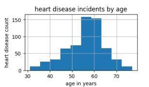
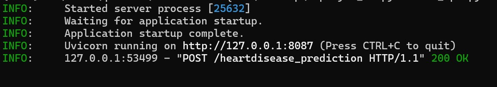
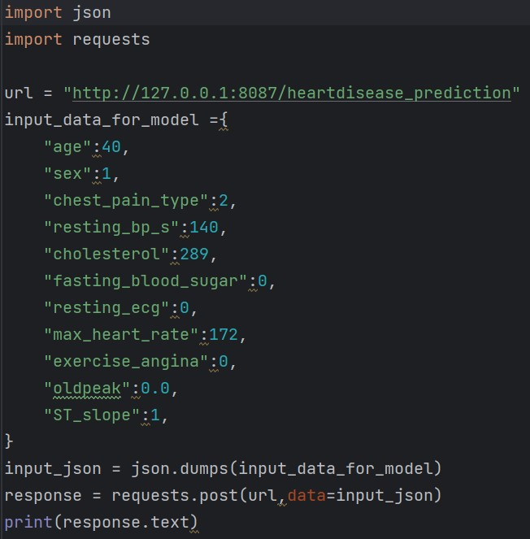

# Heart-Disease Prediction Model

## Table of Contents
- [Project Overview](#project-overview)
- [Data Sources](#data-sources)
- [EDA](#exploratory-data-analysis)
- [Recommendations](#recommendations)
- [Machine learning model](#machine-learning-model)
- [Assumptions](#assumptions)
- [Performance metrics](#performance-metrics)
- [Loss function](#loss-function)
- [Choosing a Model](#choosing-a-model)
- [Training the Model](#training-the-model)
- [Making Predictions](#making-predictions)
- [Deployee model](#deployee-model)

## Project Overview
  
  This aims to provide insights of the most common cardiovascular disease in peoples.Heart disease is the leading cause of death in the many conuntries.
  There are many different factors that can make to develop heart disease like age,sex,chest pain type,resting blood pressure,cholesterol and fasting blood sugar etc.
  we build a ml model to predict given person is having a heart disease or not.

## Data Sources

Heart Disease dataset: from kaggle datasets
Ref link - https://www.kaggle.com/datasets

[**view data**](HeartDiesease.csv)


## Tools

- CSV
- PostgreSQL - Data Analysis
- PowerBI    - Visuvalization reports
- ML Framework & lib - Scikit-learn,Numpy,Pandas & Matplotlib

## Data Cleaning/Preparation

In the initial data preparation phase, we performed the following tasks:

    1. Data loading and inspection.
    2. Handling missing values.
    3. Data cleaning and formatting.

## Exploratory Data Analysis

EDA involved exploring the heart diseases in data to answer key questions, such as:

1. what is overall heart disease rate in total population ?
   
   Ans: approx = 53%.


   

   
   
3. % males and females associated with heart diseases ?
   
   Ans: Mens with 47% and female with 6%.

   
   
   
5. what are the top 3 reasons for mens having high risk?

   Ans : age, hypertension, diabetic and chest pain.
   
6. which age group is having high risk of heart diseases ?
   
   Ans : Between age 45 and 65 years.
   
   
   


[**More EDA Anaysis**](EDA_HeartDisease.ipynb)


## Data Analysis

Include some interesting code/features worked with
```sql
-- Male have higher risk heartdisease approx 76%
select h.sex,cast(count(1) as float) / (select count(1) from heartdisease h1)*100 from heartdisease h 
where h.target in (1,0)
group by h.sex;
```
```sql
-- People prone to have a heart diseases in future
select h.age,count(1) from heartdisease h
where h.cholesterol > 240 and h."fasting blood sugar" =1 and h.target = 0
and h."exercise angina" =1
group by h.age
having h.age > 45
```
```sql
-- 52% peoples are asymptomatic with heart disease ,5% peoples have tipical chestpain having a heart disease.
select h."chest pain type" ,cast(count(1) as float)/(select count(1) from heartdisease h1)*100 from heartdisease h
group by h."chest pain type"
order by h."chest pain type"
having h.age > 45
```
[**More Query Anaysis**](QueryAnaysis.sql)

## Results/Findings

The analysis results are summarized as follows:

    1. Males have high risk of heart diseases rate.
    2. young age groups identified with high numbers in heart disease with most of them are asymptomatic. 
    3. age with other factors like cholestrol,bp and diabetic are direct relation with heart disease.

## Recommendations

Based on the analysis, we recommend the following actions:

    1. Between age 33-40 noticed high cholestrol levels, regular exercise will help to reduce the no of heart disease.

## Limitations

Since the dataset is very small / limited with approx 1190 rows and 11 features, it might slightly affects the accuracy results of my conclusions from the analysis.

## Machine learning model

Predicting heart disease is basically a binary classification model.
class - 0 -> no heart disease.
class - 1 -> heart disease.

Because the data set is small we can try to fit many classification models and compare the results. finally take the best fit model, which is going to deployee to server.

## Assumptions
1. no outliers.
2. dataset is balanced and data distrubution is identical b/w train and test sets.
3. handles all missing values.
4. interpreting the model is less important.
5. high accuracy.

## Performance metrics
1. confussion matrix.
2. accuracy score, precision and recalls.
3. roc-auc curve  [ ROC - TPR vs FPR , AUC - greater value of AUC denotes better model performance ].

## Loss function
1. log-loss since its a binary classification problem.

## Choosing a model
we will fit below all models and choose best fit model

Model         | Train accuracy  | Test accuracy | Cross Validation |  Hyperparameters   |
------------- | -------------   | ------------- | -------------    |  -------------     |                
logistic reg  |   0.83          |   0.81        |    cv=5          |   l2-reg,C=0.1     |
SVM           |   0.90          |   0.85        |    cv=5          |   default          |
RF            |   1.0           |   0.92        |    cv=5          |   log_loss,default |

Random Forest Classifier - best fit model

## Training the model
[**ML model code**](ML_Models.ipynb)

## Making predictions
[**ML model code**](ML_Models.ipynb)

## Deployee model

Deployee the model into my local machine using fastAPI.

[**source code**](ml_api.py)

Running a fastAPI server:




Test Model:
input : [40,1,2,140,289,0,0,172,0,0.0,1]




[**source code**](Test.py)


Results:


