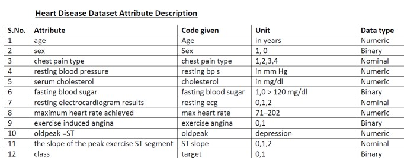
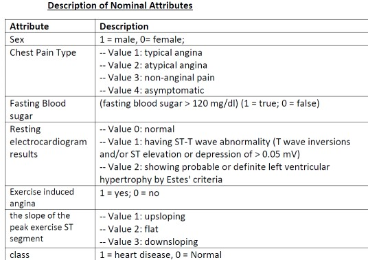
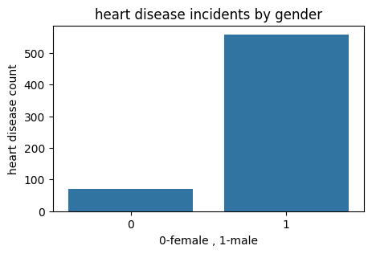
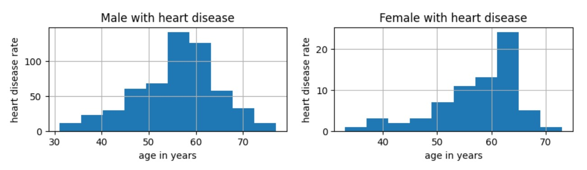

# Heart-Disease Prediction Model

# Table of Contents
- [Project Overview](#project-overview)
- [Data Sources](#data-sources)
- [EDA](#exploratory-data-analysis)
- [Recommendations](#recommendations)
- [Machine learning model](#machine-learning-model)
- [Assumptions](#assumptions)
- [Performance metrics](#performance-metrics)
- [Choosing a Model](#choosing-a-model)
- [Training the Model](#training-the-model)
- [Making Predictions](#making-predictions)
- [deployee model](#deployee-model)

## Project Overview
  
  This aims to provide insights of the most common cardiovascular disease in peoples.Heart disease is the leading cause of death in the many conuntries.
  There are many different factors that can make to develop heart disease like age,sex,chest pain type,resting blood pressure,cholesterol and fasting blood sugar etc.
  we build a ml model to predict given person is having a heart disease or not.

## Data Sources

Heart Disease dataset: from kaggle datasets.
Ref link - https://www.kaggle.com/datasets






## Tools

- CSV
- PostgreSQL - Data Analysis
- PowerBI    - Visuvalization reports 

## Data Cleaning/Preparation

In the initial data preparation phase, we performed the following tasks:

    1. Data loading and inspection.
    2. Handling missing values.
    3. Data cleaning and formatting.

## Exploratory Data Analysis

EDA involved exploring the heart diseases in data to answer key questions, such as:

1. what is overall heart disease rate in total population ?
   
   Ans: approx = 53%
   
   
   
3. what is male and female having a heart disease distribution ?

   Ans: Mens with 47% and female with 6%

   
   
   
5. what are the top 3 reasons for mens having high risk?

   Ans : age, hypertension, diabetic and chest pain
     

[**More EDA Anaysis**](EDA_HeartDisease.ipynb)


## Data Analysis

Include some interesting code/features worked with
```sql
-- Male have higher risk heartdisease approx 76%
select h.sex,cast(count(1) as float) / (select count(1) from heartdisease h1)*100 from heartdisease h 
where h.target in (1,0)
group by h.sex;
```
```sql
-- People prone to have a heart diseases in future
select h.age,count(1) from heartdisease h
where h.cholesterol > 240 and h."fasting blood sugar" =1 and h.target = 0
and h."exercise angina" =1
group by h.age
having h.age > 45
```
```sql
-- 52% peoples are asymptomatic with heart disease ,5% peoples have tipical chestpain having a heart disease.
select h."chest pain type" ,cast(count(1) as float)/(select count(1) from heartdisease h1)*100 from heartdisease h
group by h."chest pain type"
order by h."chest pain type"
having h.age > 45
```
[**More Query Anaysis**](QueryAnaysis.sql)

## Results/Findings

The analysis results are summarized as follows:

    1. The company's sales have been steadily increasing over the past year, with a noticeable peak during the holiday season.
    2. Product Category A is the best-performing category in terms of sales and revenue.
    3. Customer segments with high lifetime value (LTV) should be targeted for marketing efforts.

## Recommendations

Based on the analysis, we recommend the following actions:

    Invest in marketing and promotions during peak sales seasons to maximize revenue.
    Focus on expanding and promoting products in Category A.
    Implement a customer segmentation strategy to target high-LTV customers effectively.

## Limitations

I had to remove all zero values from budget and revenue columns because they would have affected the accuracy of my conclusions from the analysis. There are still a few outliers even after the omissions but even then we can still see that there is a positive correlation between both budget and number of votes with revenue.

## Machine learning model

## Assumptions

## Performance metrics

## Choosing a model

## Training the model

## Making predictions

## Deployee model
